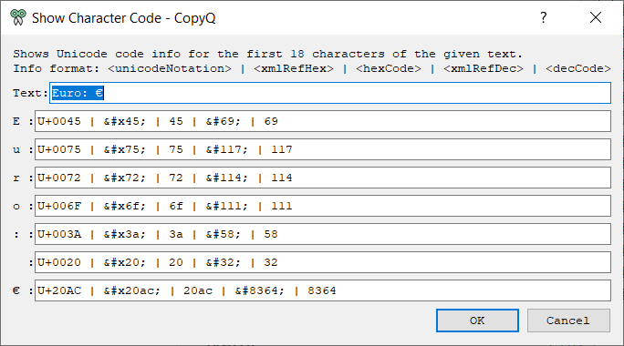

This section contains commands which can be executed with global/system shortcut
(even when the main application window is not active).

### [Copy a Secret](copy-a-secret.ini)

Copies (Ctrl+C) from current window without storing or showing the data in GUI.

### [Copy Text in Image](copy-text-in-image.ini)

Takes screenshot of selected part of the screen and tries to recognize text.

Requires [GraphicsMagick](http://www.graphicsmagick.org/download.html)
and [Tesseract](https://github.com/tesseract-ocr/tesseract/wiki/Downloads).

### [Disable Monitoring State Permanently](disable-clipboard-monitoring-state-permanently.ini)

Disables clipboard monitoring permanently, i.e. the state is restored when clipboard changes even after application is restarted.

### [Edit and Paste](edit-and-paste.ini)

Following command allows to edit current clipboard text before pasting it.

If the editing is canceled the text won't be pasted.

### [Paste Current Date and Time](paste-current-date-time.ini)

Copies current date/time text to clipboard and pastes to current window on global shortcut <kbd>Win</kbd>+<kbd>Alt</kbd>+<kbd>T</kbd>.

### [Quickly Show Current Clipboard Content](quickly-show-current-clipboard-content.ini)

Quickly pops up notification with text in clipboard using `Win+Alt+C` system shortcut.

### [Replace All Occurrences in Selected Text](replace-all-occurences-in-selected-text.ini)

### [Screenshot](screenshot.ini)

Take screenshot of the screen.

### [Screenshot Cutout](screenshot-cutout.ini)

Take screenshot of selected part of the screen.

### [Select Nth Item](select-nth-item.ini)

Quick shortcuts to activate items 0 to 9 (copy, move to top and paste depending
on preferences in History configuration tab).

### [Show Clipboard](show-clipboard.ini)

Shows notification with current clipboard content (text or image).

### [Snippets](snippets.ini)

Shows dialog with snippets to paste.

Snippets are loaded from "Snippets" tab. Item notes are used as snippet name.

Items can contain placeholders like:
- `${Name}` (default text is empty),
- `${Name:value}` (default text is "value"),
- `${Name:value1,value2,value3}` (default text is "value1"; allows to select from multiple values),
- `${Name:\n}` (multi-line text field).

When such snippet is selected, user is prompted to replace these placeholders with custom content.

To create your first snippet:

1. create "Snippets" tab (Ctrl+T),
2. add new item (Ctrl+N) with a snippet:

    You picked ${Fruit:apples,oranges,pears}!

3. set optional snippet name (Ctrl+F2), e.g. "Fruit".

Triggering the Snippets command (with a global shortcut) will show a simple
dialog where you can pick the snippet by its name.

To pick different tab name, you have to change the command's code.

    var snippetsTabName = '&Snippets'

### [Toggle Clipboard Storing](toggle-clipboard-storing.ini)

Toggles clipboard storing/monitoring with global shortcut or from menu/toolbar.

### [Capitalize Selected Text for Titles](to-title-case.ini)

E.g. changes "Do androids dream of electric sheep?" to "Do Androids Dream of Electric Sheep?".

### [Change Upper/Lower Case of Selected Text](toggle-upper-lower-case-of-selected-text.ini)

Toggles between upper- and lower-case letters in selected text.

### [Diff Latest Items](diff-latest-items.ini)

Compares two clipboard history items with your preferred diff tool.

The latest two items get compared when the command is run as a global command.
You can also run the command on any two items selected in the main window.

By default, this command launches [Beyond Compare 4](https://www.scootersoftware.com/download.php)
for doing the comparison.
You can find examples of launching other tools like [WinMerge](https://winmerge.org/downloads) directly in the command's source code.

### [Convert Markdown to ...](convert-markdown.ini)

Converts text written in [Markdown syntax](https://daringfireball.net/projects/markdown/syntax)
to desired format, which can be for example:

* HTML
* [Jira markup](https://jira.atlassian.com/secure/WikiRendererHelpAction.jspa?section=all)
* JSON (AST) (JSON representation of the parsed text; useful rather for contributors than users)
* [LaTeX](https://en.wikipedia.org/wiki/LaTeX)

The command can be run on any text selection via a global shortcut or over items selected
in the main window.

#### Installation

This script relies on the [mistletoe](https://github.com/miyuchina/mistletoe) project to do the
actual Markdown parsing and conversion.
This in turn requires that [Python](https://www.python.org/downloads/) 3.x is installed on the user computer.

At the time of writing, the mistletoe project seems to abandoned by its maintainers, so for example
if a really working conversion to Jira markup is needed (see [PR #100](https://github.com/miyuchina/mistletoe/pull/100)),
the recommended mistletoe installation steps are the following:

    cd /path/to/directory/of/your/choice
    git clone https://github.com/pbodnar/mistletoe.git
    cd mistletoe
    git checkout master-pbo
    pip3 install -e .

For output format "HTML + code highlighting", an additional Python module needs to be installed:

    pip3 install pygments

### [Show Character Code](show-char-code.ini)

Shows Unicode code info for the first characters of any text. An example of how this looks like:

