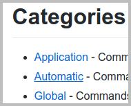
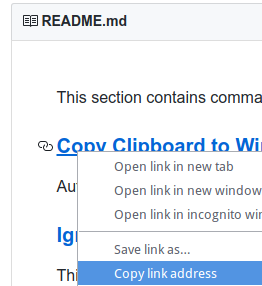
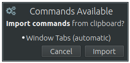

Useful commands for [CopyQ clipboard manager](https://github.com/hluk/CopyQ).

You can share your commands and ideas here.
Just open pull request or an issue.

# Categories

- [Application](https://github.com/hluk/copyq-commands/tree/master/Application) - Commands which can be executed from tool bar, menu or with shortcut
- [Automatic](https://github.com/hluk/copyq-commands/tree/master/Automatic) - Commands which are executed automatically whenever something is copied to clipboard
- [Global](https://github.com/hluk/copyq-commands/tree/master/Global) - Commands which can be executed with global/system shortcut
- [Scripts](https://github.com/hluk/copyq-commands/tree/master/Scripts) - Scripts for changing application behavior, extending command line and adding functionality
- [Templates](https://github.com/hluk/copyq-commands/tree/master/Templates) - Templates for new commands

# Add a Command to CopyQ

To add a command to CopyQ:

- copy the command code (starts with `[Command]` or `[Commands]` for multiple commands),
- open CopyQ,
- open Command dialog (<kbd>F6</kbd> shortcut),
- click "Paste Commands" button (or <kbd>Ctrl</kbd>+<kbd>V</kbd>),
- apply changes.

To **simplify this** add [command](Automatic/import-commands-after-copied.ini)
which shows notification with button to import all commands copied to clipboard.
This also works if you just copy a link with commands.

# Write new Commands

See following documentation about writing commands and scripting.

- [Writing Commands and Adding Functionality](https://copyq.readthedocs.io/en/latest/writing-commands-and-adding-functionality.html)
- [Scripting](https://copyq.readthedocs.io/en/latest/scripting.html)
- [Scripting API](https://copyq.readthedocs.io/en/latest/scripting-api.html)

Submit new pull request in this repository if you want to share a command.

